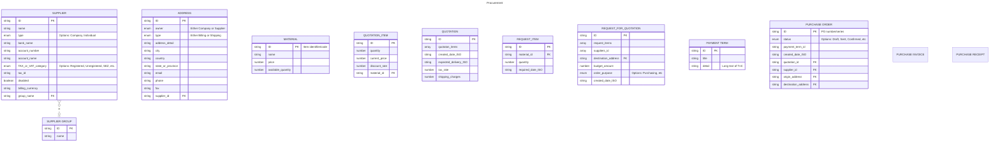

# Entity Relationship Diagrams

These can be previewed using Markdown extension in IDE or https://mermaid.live/edit.

## Procurement

```mermaid
---
title: Procurement
---
erDiagram
    direction TB
    "SUPPLIER GROUP" {
        string ID PK
        string name
    }
    SUPPLIER }o..o| "SUPPLIER GROUP" : in
    SUPPLIER {
        string ID PK
        string name
        enum type "Options: Company, Individual"
        string bank_name
        string account_number
        string account_name
        enum TAX_or_VAT_category "Options: Registered, Unregistered, SEZ, etc."
        string tax_id
        boolean disabled
        string billing_currency
        string group_name FK
    }
    ADDRESS {
        string ID PK
        enum owner "Either Company or Supplier"
        enum type "Either Billing or Shipping"
        string address_detail
        string city
        string country
        string state_or_province
        string email
        string phone
        string fax
        string supplier_id FK
    }
    MATERIAL {
        string ID PK "Item identifier/code"
        string name
        number price
        number available_quantity
    }
    QUOTATION_ITEM {
        string ID PK
        number quantity
        number current_price
        number discount_rate
        string material_id FK
    }
    QUOTATION {
        string ID PK
        array quotaton_items
        string created_date_ISO
        string expected_delivery_ISO
        number tax_rate
        number shipping_charges
    }
    REQUEST_ITEM {
        string ID PK
        string material_id FK
        number quantity
        string required_date_ISO
    }
    REQUEST_FOR_QUOTATION {
        string ID PK
        array request_items
        array suppliers_id
        string destination_address FK
        number budget_amount
        enum order_purpose "Options: Purchasing, etc"
        string created_date_ISO
    }
    "PAYMENT TERM" {
        string ID PK
        string title
        string detail "Long text of TnC"
    }
    "PURCHASE ORDER" {
        string ID PK "PO number/series"
        enum status "Options: Draft, Sent, Confirmed, etc"
        string payment_term_id
        string created_date_ISO
        string quotation_id FK
        string supplier_id FK
        string origin_address FK
        string destination_address FK
    }
    "PURCHASE INVOICE" {

    }
    "PURCHASE RECEIPT" {

    }
```
